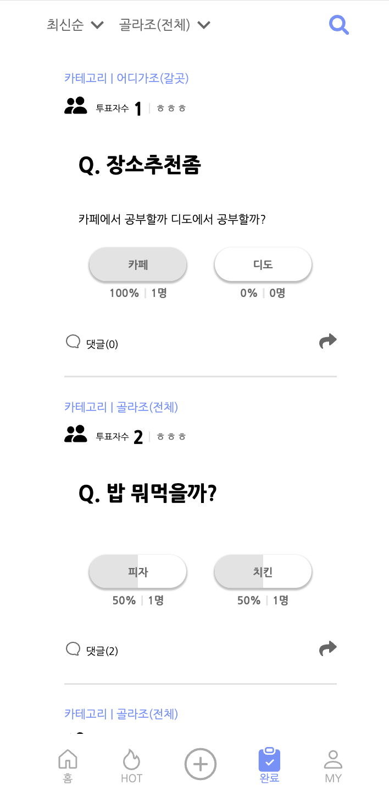
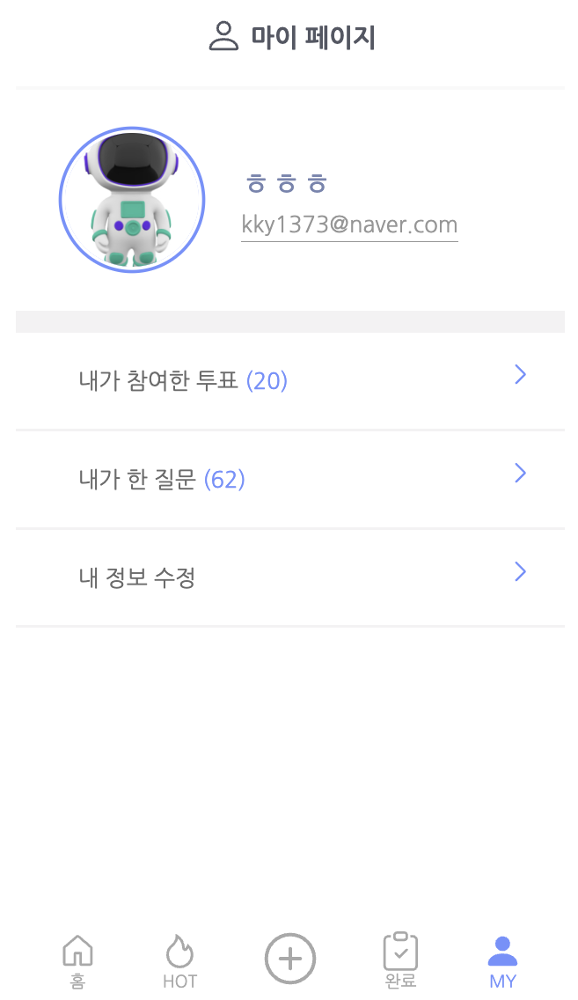
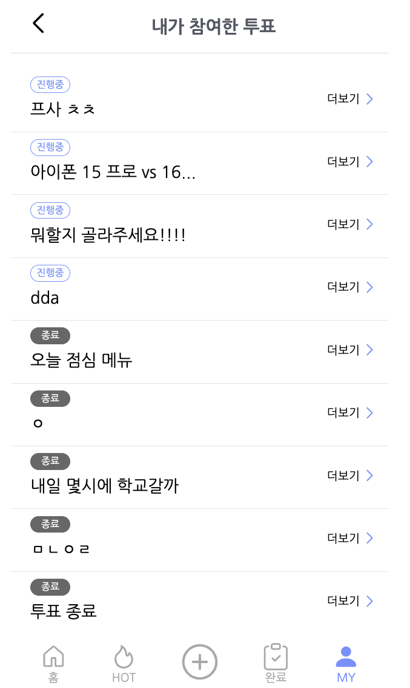
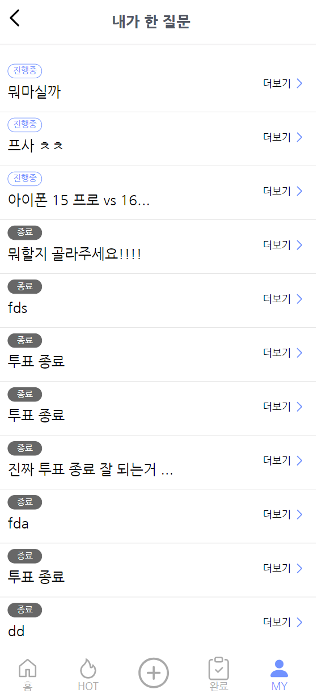
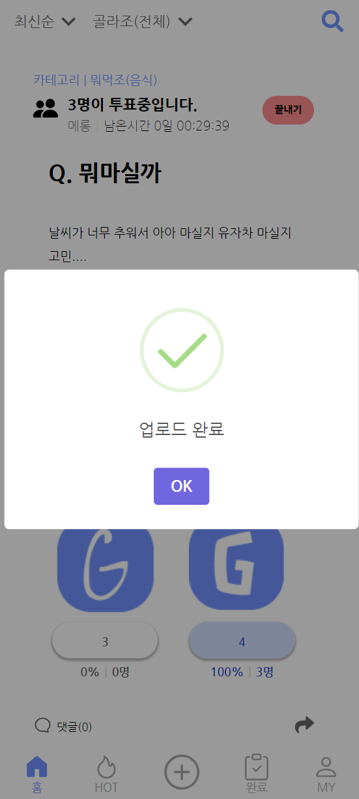
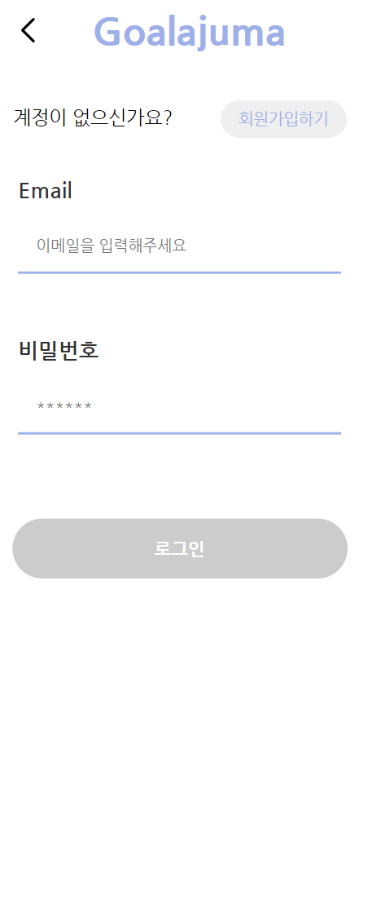
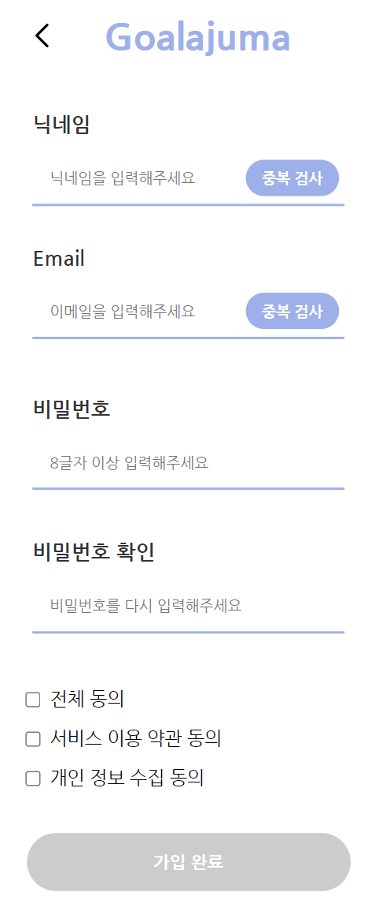
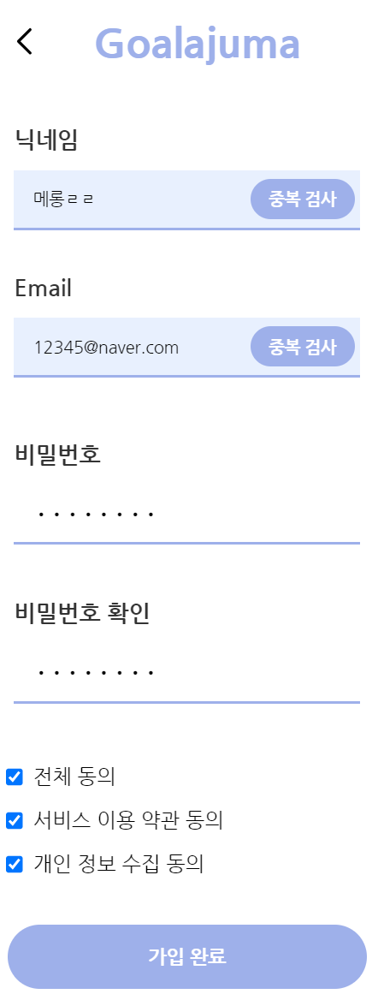

# 골라주마(Goalajuma) - 투표 커뮤니티 서비스

개발 기간 : 2023.09.04 - 2023.11.11

# 목차

- [배포주소](#배포주소)
- [프로젝트 소개](#프로젝트-소개)
- [기술스택](#기술스택)
- [화면 구성](#화면-구성)
- [주요기능](#주요기능)
- [프로젝트 포스터](#프로젝트-포스터)
- [팀 소개](#팀-소개)

# 배포주소

### https://k0c0f9c1d73ada.user-app.krampoline.com/

# 프로젝트 소개

골라주마는 온라인 투표 커뮤니티 서비스로, 작성자의 질문을 모두가 공유하고 고민할 수 있는 반응형 웹앱입니다.  

# 기획 의도
남녀 노소, 떄와 장소를 구분하지 않고 발생하는 선택장애라는 문제를 해결하기 위해 다수의 의견이 필요하다는 설문 조사 결과를 얻었습니다. 이에 따라 많은 사람들이 자신의 크고 작은 고민들을 공유하고 다른 사람들의 고민을 함께 고민할 수 있는 커뮤니티를 개발하였습니다. 

# 주요기능
1. 사용자가 질문을 업로드 할 수 있는 기능
2. 사용자가 다른 사용자들의 질문들에 투표할 수 있는 기능
3. 게시글 검색 기능
4. 게시글에 댓글을 달 수 있는 기능
5. 해당 게시글을 공유할 수 있는 기능
6. 자신이 작성한 글, 자신이 투표에 참여한 글을 확인할 수 있는 기능

# 화면 구성

## 메인 페이지 , 완료된 페이지, 핫 게시판

|  |  |  |
| ------------------------------ | ------------------------------ | ------------------------------ |

## 모달창, 공유하기

## 마이페이지
|  |  |  |
| ------------------------------ | ------------------------------ | ------------------------------ |

|  |  |  |
| ------------------------------------------ | -------------------------------- | -------------------------------- |

## 업로드 페이지 , 검색 페이지
|  |  |  |
| ------------------------------ | ------------------------------ | ------------------------------ |

## 로그인, 회원가입
|  |  |  |
| ------------------------------ | ------------------------------ | ------------------------------ |
# 기술스택

|                                                                                                                                                         collaboration                                                                                                                                                         |                                                                                                                                                                                                                                                                                                                                                                                            Front End                                                                                                                                                                                                                                                                                                                                                                                            |
| :---------------------------------------------------------------------------------------------------------------------------------------------------------------------------------------------------------------------------------------------------------------------------------------------------------------------------: | :---------------------------------------------------------------------------------------------------------------------------------------------------------------------------------------------------------------------------------------------------------------------------------------------------------------------------------------------------------------------------------------------------------------------------------------------------------------------------------------------------------------------------------------------------------------------------------------------------------------------------------------------------------------------------------------------------------------------------------------------------------------------------------------------: |
|    |       |

# 개발 문서

[노션 링크](https://www.notion.so/4dca9a915de8493480110f18bdf784a3?v=c8900fb6098a431489692ecb22232af9&pvs=4)

# 팀 소개

|                                FE                                |                               FE                                |                                FE                                |
| :--------------------------------------------------------------: | :-------------------------------------------------------------: | :--------------------------------------------------------------: |
|               [김가연(리마인더)](https://github.com/dle234)                |              [문지혜(기획리더)](https://github.com/munjihye)              |               [강성준(리액셔너)](https://github.com/ketru44)               |
|  |  |  |

|                                BE                                |                               BE                                |                               BE                                |
| :--------------------------------------------------------------: | :-------------------------------------------------------------: | :-------------------------------------------------------------: |
|          [진우석(조장)](https://github.com/jinwooseok)           |                           [김수민(테크리더)](https://github.com/kssumin)                            |                           [박현수(타임키퍼)](https://github.com/PHS00)                            |
|  |  |  |
